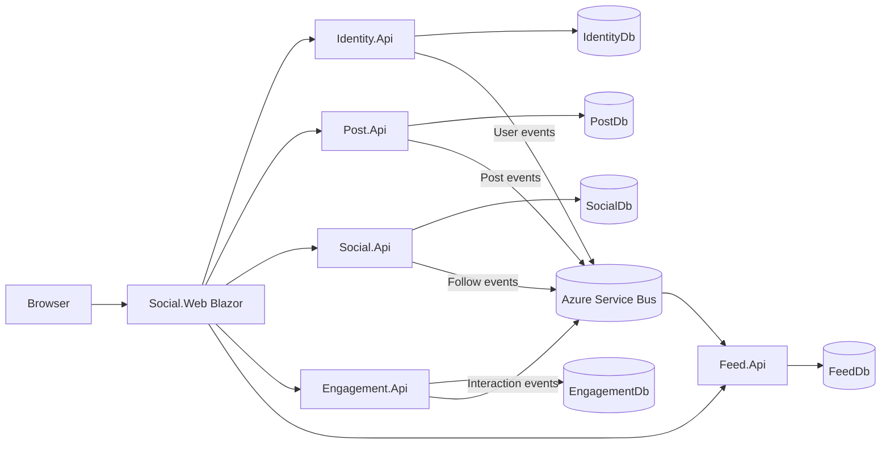

# Microservices Social App Design

## Reference Behavior

The reference `../domain-driven-design-csharp` application is a Blazor social feed backed by one ASP.NET Core API. The required user-facing behavior is:

- Register and log in.
- View the current user profile and another user's profile.
- Create, edit, delete, list, and search posts.
- Follow and unfollow users.
- Like and comment on posts.
- View a personalized timeline/feed.
- View another user's posts from their profile.

The reference app also includes MFA, email verification, password reset, media uploads, reposts, blocks, and profile images. Those are intentionally outside the first microservices implementation because the target is a minimal microservices comparison, not full feature parity.

## Chosen Approach

Use a strict CRUD-oriented microservice split with a Blazor Server web app as the browser-facing composition layer:

- `Identity.Api`: registration, login, profile lookup, display-name updates.
- `Post.Api`: create, edit, delete, retrieve, and search posts.
- `Social.Api`: follow and unfollow relationships.
- `Engagement.Api`: likes and comments.
- `Feed.Api`: timeline projection and feed queries.
- `Social.Web`: Blazor Server web app that calls REST APIs and stores the JWT in protected browser storage.
- `Shared.Contracts`: integration-event and DTO contracts shared by services.

Each service owns one Mongo database. The MongoDB client is used directly so the same code can connect to Azure Cosmos DB for MongoDB in Azure and MongoDB locally. Cross-service state is propagated with Azure Service Bus-compatible integration events. Local development uses a simple in-process/local event bus by default plus Docker Compose for MongoDB and all services. The event abstraction is intentionally small so Azure Service Bus can be enabled by connection string without changing service logic.

## Data Ownership

No service reads another service's database.

- `IdentityDb.users`: user credentials, handle, email, display name.
- `PostDb.posts`: authored posts and post text.
- `SocialDb.follows`: follower/following relationships.
- `EngagementDb.likes`, `EngagementDb.comments`: interaction records.
- `FeedDb.feedEntries`: denormalized timeline entries maintained from events.

Services keep only the copied fields needed for their own behavior. For example, `Feed.Api` stores author display fields and engagement counts because it serves the timeline read model.

## Integration Events

Events are plain records in `Shared.Contracts`:

- `UserCreated`
- `UserProfileUpdated`
- `PostCreated`
- `PostUpdated`
- `PostDeleted`
- `UserFollowed`
- `UserUnfollowed`
- `LikeAdded`
- `LikeRemoved`
- `CommentAdded`

The first implementation publishes events through an `IEventPublisher` abstraction. Services that need to react expose consumer endpoints or background handlers depending on the host. Azure Service Bus is the production transport. Docker Compose provides the services and MongoDB local equivalents; local event delivery can run in lightweight mode for easier demos.

## API Shape

REST commands stay simple:

- `Identity.Api`: `POST /api/users/register`, `POST /api/users/login`, `GET /api/users/me`, `GET /api/users/by-handle/{handle}`, `PUT /api/users/me/display-name`.
- `Post.Api`: `POST /api/posts`, `PUT /api/posts/{id}`, `DELETE /api/posts/{id}`, `GET /api/posts/{id}`, `GET /api/posts/by-user/{userId}`, `GET /api/posts/search`.
- `Social.Api`: `POST /api/users/{handle}/follows`, `DELETE /api/users/{handle}/follows`.
- `Engagement.Api`: `POST /api/posts/{id}/likes`, `DELETE /api/posts/{id}/likes`, `POST /api/posts/{id}/comments`, `GET /api/posts/{id}/comments`.
- `Feed.Api`: `GET /api/feed`, `GET /api/feed/users/{userId}`.

`Social.Web` composes calls where the UI needs data owned by multiple services. That keeps APIs independent and avoids cross-database joins.

## Architecture Diagram

## Migration Strategy

1. Extract identity endpoints first and keep the monolith UI calling the new identity API through a temporary adapter.
2. Extract post CRUD and keep feed reads in the monolith until post events are flowing.
3. Extract follows, then emit follow events for feed personalization.
4. Extract likes and comments, then update feed projections from engagement events.
5. Move feed reads to `Feed.Api` once projection lag is acceptable.
6. Replace the monolith client with `Social.Web`.
7. Retire monolith persistence after all reads and writes are routed to service-owned databases.

## Tradeoffs

The DDD monolith keeps behavior cohesive, enforces rich invariants in one process, and is easier to debug. It also couples all user journeys to one deployable and one persistence model.

The microservices implementation improves ownership boundaries and shows independent deployability, separate databases, and eventual consistency. It also adds operational cost: multiple services, event delivery, projection lag, distributed authentication, and more integration testing. The design intentionally avoids DDD, repositories, CQRS, and event sourcing so those costs remain visible instead of being hidden behind enterprise abstractions.
